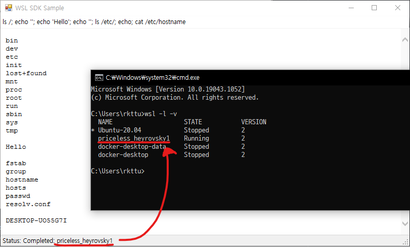

# Out-of-process COM server style WSL SDK

[](https://github.com/wslhub/wsl-sdk-com/actions/workflows/wsl-sdk-com-build.yml)



이 프로젝트에는 OOP(out-of-process) 스타일 COM 서버 기반 WSL API가 포함되어 있습니다. 이 기술로 CoInitializeSecurity 이슈에 대한 해결 및 .NET Framework 사용에 대한 코드 관리 용이성을 지속할 수 있습니다.

Windows PowerShell, LINQPad, COM 지원 클라이언트 등을 이용하시면 OOP 스타일 COM 서버를 사용하여 WSL 명령을 쿼리하고 실행할 수 있습니다. 한 번 등록된 후에는 COM 인터페이스를 호출할 때 마다, 실행 파일이 자동으로 호출되고 요청에 따라 실행됩니다. 참조 횟수가 0이 되면 프로세스는 자동으로 종료됩니다.

## 빌드와 테스트

1. Windows 10(1903 릴리즈 이상)에서 .NET Framework SDK v4.0 이상을 사용하시는 경우 이 프로젝트를 빌드하실 수 있습니다.
1. WslSdk 프로젝트의 릴리스를 빌드하신 후 관리자 권한으로 `Install.cmd` 배치 파일을 실행하여 OOP COM 서버를 등록합니다.
1. 이제 단위 테스트를 실행하거나, 혹은 샘플 PowerShell 스크립트를 실행하여 테스트하실 수 있습니다.
   ```powershell
   $ErrorActionPreference = "Stop"
   $obj = New-Object -ComObject 'WslSdk.WslService'

   Write-Output 'A WslSdk.WslService object is created'

   # Distro Register Check
   $distroName = 'Ubuntu-20.04'
   Write-Output $obj.IsDistroRegistered($distroName)

   # Metadata Query
   $o = $obj.GetDefaultDistro()
   Write-Output "Distro ID: $($o.DistroId())"
   Write-Output "Distro Name: $($o.DistroName())"

   $list = $obj.GetDistroList()
   Write-Output $list

   # Run WSL command
   $res = $obj.RunWslCommand($o.DistroName(), "cat /etc/os-release")
   Write-Output $res

   $obj = $null
   ```
1. OOP COM 서버를 제거하고자 하시는 경우, 관리자 권한으로 `Uninstall.cmd` 배치 파일을 실행하십시오.

## 코드 예제

- [Excel and Visual Basic for Application](sample/Excel/WslSdkSample.xlsb)
- [Jupyter Notebook and Python 3.x](sample/JupyterNotebook/Sample.ipynb)
- [Windows PowerShell 5.x](sample/PowerShell/Sample.ps1)
- [LINQPAD 5](sample/LinqPad5/)
- [.NET Framework 4.5](sample/NetFx4/)

## 주의사항

- 현재까지는 WSL COM 인터페이스에 대한 공식적인 사양이 지정되지 않았기 때문에 본 SDK는 제한된 WSL Win32 API로 제작하였습니다.
- 전체 COM 통합 기능은 부족하였기 때문에 본 SDK를 개발할 때 .NET Core 혹은 .NET 5+를 선택하지 않았습니다. 현재 .NET Core 혹은 .NET 5+를 사용 시 OOP COM 서버 구축이 매우 복잡해집니다. 그러나 개선 사항 진행시에 .NET Core 또는 .NET 5+ 런타임으로 마이그레이션하려 합니다.
- 이 OOP COM 서버를 자동 등록 모듈로 만들려고 했지만, 실패했습니다. 누구든지 이 자동 등록 기능 개선 사항에 기여해 주시면 이 SDK를 사용이 훨씬 더 유연해질 걸로 기대합니다.

## 해야할 일

- v1 COM 인터페이스 문서 작성
- ARM64 지원 추가

## 오픈소스 라이선스 고지

이 프로젝트는 MIT license에 기반하여 제작하였습니다. 자세한 내용은 [LICENSE.txt](LICENSE.txt) 내용을 참고하세요.
